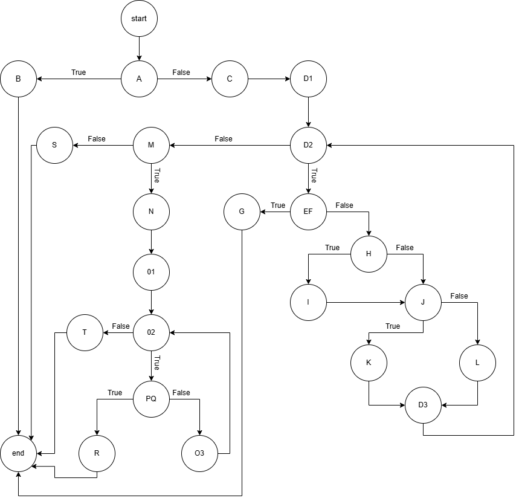
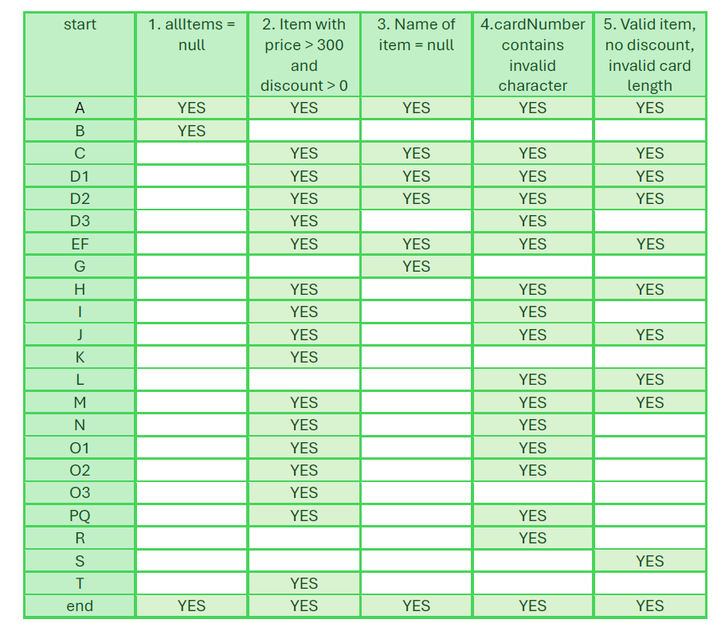
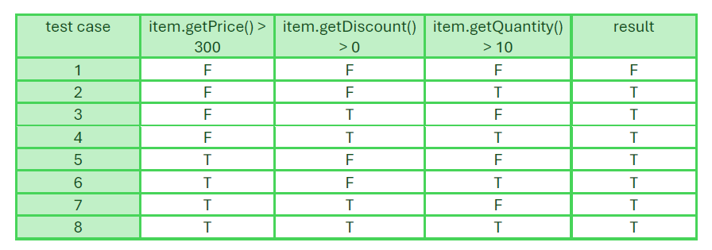

# Втора лабараториска вежба по Софтверско инженерство 
## Теодора Ѓоргиевска, бр. на индекс 233249
### Control Flow Graph

### Цикломатската комплексност
Цикломатската комплексност на овој код е 9. Истата ја добив преку формулата P + 1, каде што P е бројот на предикатни јазли. Во овој случај, P = 8, бидејќи има вкупно 8 места во кодот каде што се врши одлука (if, for, ||, &&). Според тоа, цикломатската комплексност изнесува 8 + 1 = 9.
### Тест случаи според критериумот Every statement

### Тест случаи според критериумот Multiple Condition

### Објаснување на напишаните unit tests
#### Every Statement критериумот има 5 тестови:
##### Тест 1: allItems = null
Се праќа null листа. Се очекува програмата да фрли RuntimeException со порака "allItems list can't be null!".
##### Тест 2: Item со price > 300 и discount > 0
Се праќа листа со еден Item со price = 500, discount = 0.15, и quantity = 2. Се очекува програмата да го активира одбивањето од -30 и да пресмета цена со попуст. Се користи валиден cardNumber со точно 16 цифри.
##### Тест 3: Item со name = null
Се праќа листа со еден Item и за променливата name имаме вредност null. Се очекува програмата да фрли RuntimeException со порака "Invalid item!".
##### Тест 4: cardNumber contains invalid character
Се праќа валиден Item, но cardNumber = "1234a67890123456" содржи недозволен карактер ('a'). Се очекува програмата да фрли RuntimeException со порака "Invalid character in card number!".
##### Тест 5: Valid item, no discount, invalid card length
Се праќа валиден Item, но cardNumber е пократок од 16 цифри. Се очекува програмата да фрли RuntimeException со порака "Invalid card number!".
#### Multiple Condition критериумот за условот if (item.getPrice() > 300 || item.getDiscount() > 0 || item.getQuantity() > 10) има 8 тестови:
##### Test 1: F || F || F = F
Се праќа Item кој не ги исполнува ниту еден од трите услови. Се очекува условот да врати false да не одземе 30 од сумата и исто така да не се пресмета попуст.
##### Test 2: F || F || T = T
Само quantity е > 10. Се очекува условот да врати true, и да се активира sum -= 30.
##### Test 3: F || T || F = T
Само discount е > 0. Се очекува да се одземе 30 од сумата и да се примени попуст.
##### Test 4: F || T || T = T
Discount и quantity го исполнуваат условот. Се очекува да се одземе 30 од сумата и да се примени попуст.
##### Test 5: T || F || F = T
Само price е > 300. Се очекува условот да врати true и да се примени попуст.
##### Test 6: T || F || T = T
Price и quantity го исполнуваат условот и ќе се одземе 30 од сумата.
##### Test 7: T || T || F = T
Price и discount го исполнуваат условот исто и тука ќе се одземе 30 од сумата и ќе се пресмета попуст затоа што discount > 0.
##### Test 8: T || T || T = T
Сите три услови се true. Што значи дека ќе одземе 30 од сумата и ќе се пресмета попуст.
